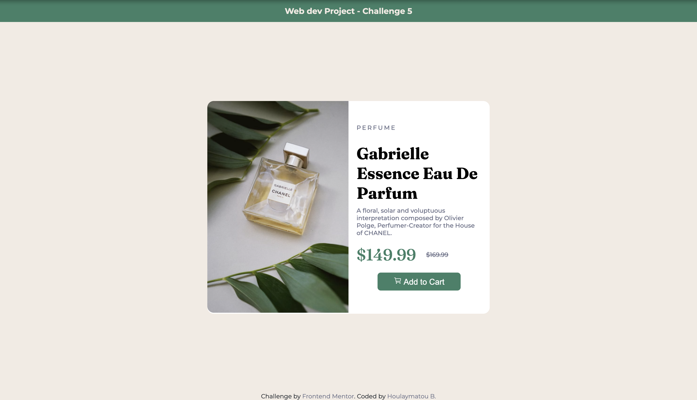

# Product preview card component solution

This is a solution to the [Product preview card component challenge on Frontend Mentor](https://www.frontendmentor.io/challenges/product-preview-card-component-GO7UmttRfa).

## Built With 🛠️

- **Semantic HTML5**: Clean, meaningful, and accessible structure.
- **CSS3**: Leveraging advanced features such as custom properties and flexbox for efficient layout designs.
- **Modern CSS Practices**:
- CSS Variables for maintaining reusable and consistent color schemes.
- Media queries for creating responsive, mobile-friendly designs.
